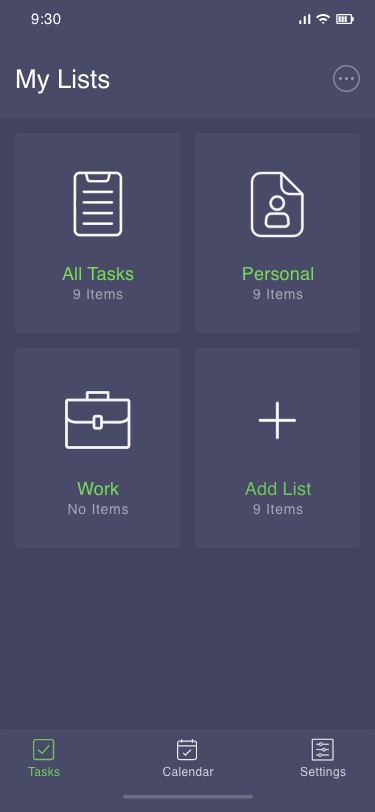
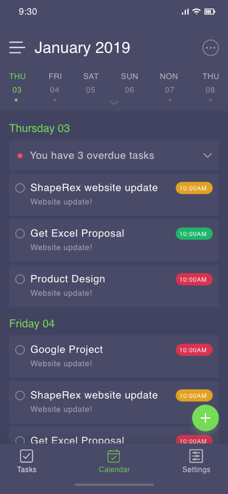
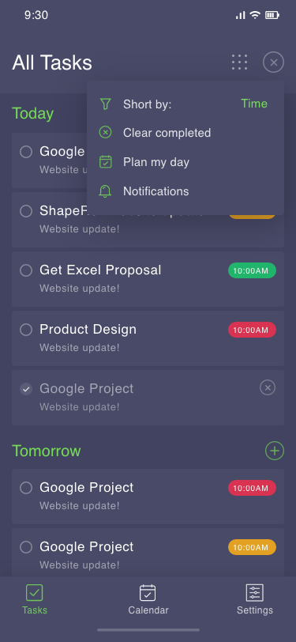
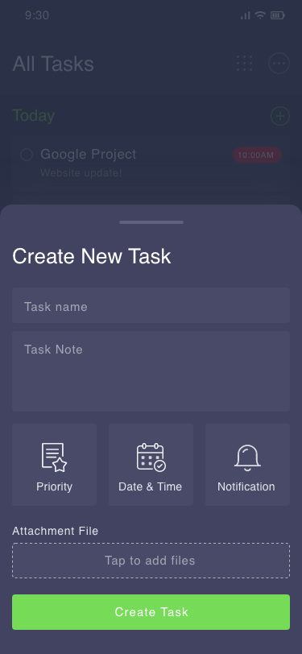
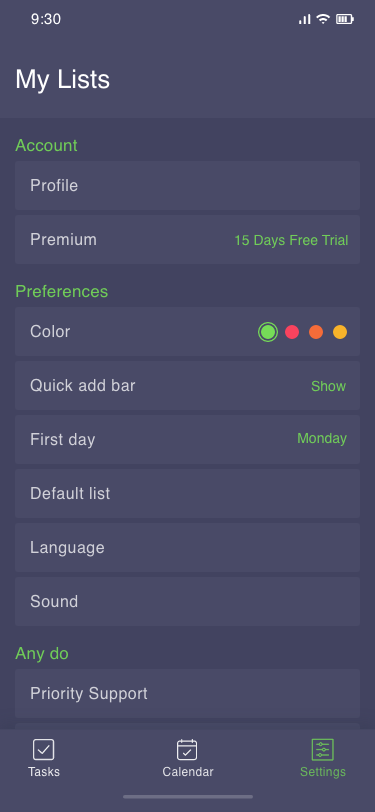
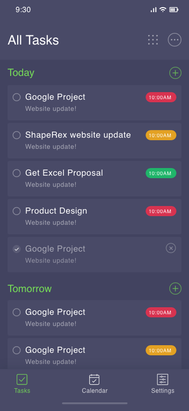

# Organizar 

Get more done with the Amusoftech`s Organizar mobile app. Manage, capture, and edit your tasks from anywhere, at anytime, with to-dos that sync across all your devices.

  
  <h3>Screenshots</h3>
 

<h3> Quickly capture tasks anywhere</h3>
• Create task lists with your most important to-dos  
• View, edit, and manage tasks on the go, from any device  

<h3>Stay on track with due dates and notifications</h3>
• Set a due date for every task to help you achieve your goals 
• Organize your tasks by date or prioritize using drag-and-drop 
• Receive due date notification reminders to keep your tasks on track 

<a href="http://amusoftech.com" target="_blank" rel="noopener noreferrer">Visit us for more cool stuff.</a>
 